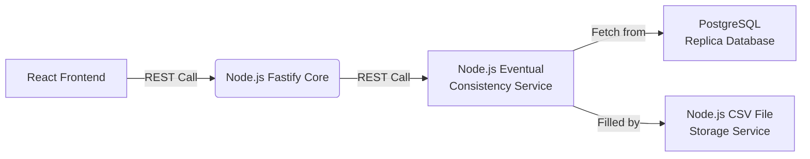

# CSV Sales Loader Application

Interactive sales loading simulator made to handle large amounts of CSV data with pagination and mitigation strategies. The solution works on an "eventual-consistence" based model where the data is constantly updated from a CSV storage delivery service to a PostgreSQL replica database that is where the data will be fetched until needs to be updated again. Made with React, Fastify and PostgreSQL.

